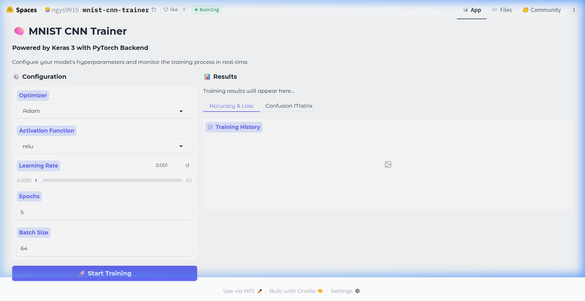

<div align="center">

# 🧠 MNIST CNN Trainer

**An interactive deep learning playground for training and evaluating CNNs on MNIST**

[](https://gradio.app)
[](https://keras.io)
[](https://pytorch.org)
[](https://huggingface.co/spaces/tertiaryinfotech/cnn-mnist-trainer)
[](https://python.org)
[](https://opensource.org/licenses/MIT)

<br />



<br />

[**Try the Live Demo →**](https://huggingface.co/spaces/ngys9919/mnist-cnn-trainer)

</div>

---

## ✨ Features

| Feature | Description |
|---------|-------------|
| 🎛️ **Hyperparameter Tuning** | Adjust optimizer, activation function, learning rate, epochs, and batch size via an intuitive UI |
| 📊 **Real-Time Visualizations** | Training accuracy/loss curves and confusion matrix generated after each run |
| ⚡ **Keras 3 + PyTorch** | Leverages the new multi-backend Keras 3 with PyTorch as the compute engine |
| 📈 **Progress Tracking** | Live epoch-by-epoch progress bar with loss and accuracy updates |
| 🚀 **One-Click Deployment** | Deploy to Hugging Face Spaces with a single script |

---

## 🏗️ Architecture

```
┌───────────────────────────────────────────────────┐
│                  Gradio Frontend                  │
│  ┌─────────────┐          ┌────────────────────┐  │
│  │ Config Panel │          │   Results Panel    │  │
│  │ • Optimizer  │  Click   │ • Training Summary │  │
│  │ • Activation │ ──────▶  │ • Accuracy/Loss    │  │
│  │ • LR / Epoch │          │ • Confusion Matrix │  │
│  │ • Batch Size │          │                    │  │
│  └─────────────┘          └────────────────────┘  │
├───────────────────────────────────────────────────┤
│              Keras 3 (PyTorch Backend)            │
│  ┌────────────────────────────────────────────┐   │
│  │  Input(28×28×1) → Conv2D(32) → MaxPool     │   │
│  │  → Conv2D(64) → MaxPool → Flatten          │   │
│  │  → Dropout(0.5) → Dense(128) → Dense(10)   │   │
│  └────────────────────────────────────────────┘   │
├───────────────────────────────────────────────────┤
│                   MNIST Dataset                   │
│         60,000 train / 10,000 test images         │
└───────────────────────────────────────────────────┘
```

---

## 🚀 Quick Start

### Prerequisites

- Python 3.14+ (or compatible version)
- [uv](https://docs.astral.sh/uv/) (recommended) or pip

### Installation

```bash
# Clone the repository
git clone https://github.com/ngys9919/ti-topic1-gradio.git
cd ti-topic1-gradio

# Install dependencies with uv (recommended)
uv pip install -r requirements.txt

# Or with pip
pip install -r requirements.txt
```

### Run Locally

```bash
# Using uv
uv run app.py

# Or with Python directly
python app.py
```

Then open **http://127.0.0.1:7860** in your browser.

---

## 🎛️ Configurable Hyperparameters

### Optimizers

| Optimizer | Best For |
|-----------|----------|
| **Adam** | General-purpose, fast convergence (default) |
| **SGD** | Simple baseline, good for comparison |
| **SGD + Momentum** | Faster than vanilla SGD, helps overcome local minima |
| **RMSprop** | Adaptive learning rate, good for noisy gradients |
| **AdamW** | Adam with decoupled weight decay, modern choice |

### Activation Functions

| Activation | Characteristics |
|------------|----------------|
| **ReLU** | Fast, avoids vanishing gradient (default) |
| **Sigmoid** | Classic, prone to vanishing gradient |
| **Tanh** | Zero-centered, better than sigmoid for hidden layers |
| **Leaky ReLU** | Prevents dead neurons |
| **ELU** | Smooth, pushes mean activations toward zero |
| **Swish** | Self-gated, often outperforms ReLU in deeper networks |

### Other Parameters

| Parameter | Range | Default |
|-----------|-------|---------|
| Learning Rate | 0.0001 – 0.1 | 0.001 |
| Epochs | 1+ | 5 |
| Batch Size | 1+ | 64 |

---

## 🧪 Suggested Experiments

Try these combinations to build intuition about how hyperparameters affect training:

| Experiment | Optimizer | Activation | LR | Expected Behavior |
|------------|-----------|------------|-----|-------------------|
| Baseline | Adam | ReLU | 0.001 | Fast convergence, ~99% accuracy |
| Slow Learner | SGD | ReLU | 0.01 | Steady but slower convergence |
| Vanishing Gradient | SGD | Sigmoid | 0.01 | Poor performance, slow learning |
| Modern Combo | AdamW | Swish | 0.001 | Smooth training, high accuracy |
| High LR | Adam | ReLU | 0.1 | Unstable training, oscillating loss |

---

## 📁 Project Structure

```
mnist-cnn-trainer/
├── app.py                  # Main application (Gradio UI + training logic)
├── mnist_cnn_trainer.py    # CNN trainer module (importable)
├── main.py                 # Entry point (imports and launches demo)
├── deploy_to_hf.py         # Deployment script for Hugging Face Spaces
├── requirements.txt        # Python dependencies
├── pyproject.toml          # Project metadata
├── CNN-MNIST-TRAINER-GUIDE.md  # Step-by-step vibe coding guide
└── assets/
    └── demo-screenshot.png # Application screenshot
```

---

## ☁️ Deploy to Hugging Face Spaces

1. **Get a Hugging Face token** with **Write** permissions from [Settings → Tokens](https://huggingface.co/settings/tokens)

2. **Update the token** in `deploy_to_hf.py`:
   ```python
   token = "hf_YOUR_TOKEN_HERE"
   ```

3. **Run the deployment script**:
   ```bash
   python deploy_to_hf.py
   ```

4. **Wait 2–5 minutes** for Hugging Face to build and serve the app.

> [!TIP]
> You can also deploy via the Hugging Face CLI:
> ```bash
> huggingface-cli login --token hf_YOUR_TOKEN_HERE
> huggingface-cli repo create cnn-mnist-trainer --type space --space-sdk gradio
> ```

---

## 🛠️ Tech Stack

| Layer | Technology |
|-------|-----------|
| **Frontend** | [Gradio](https://gradio.app) with Soft theme |
| **Deep Learning** | [Keras 3](https://keras.io) (multi-backend) |
| **Compute Backend** | [PyTorch](https://pytorch.org) |
| **Visualization** | [Matplotlib](https://matplotlib.org) + [Seaborn](https://seaborn.pydata.org) |
| **Metrics** | [scikit-learn](https://scikit-learn.org) (confusion matrix) |
| **Hosting** | [Hugging Face Spaces](https://huggingface.co/spaces) |

---

## 📖 How It Was Built

This project was built using **vibe coding** — describing the desired application to an AI assistant and iteratively refining the output. See the full walkthrough in [`CNN-MNIST-TRAINER-GUIDE.md`](CNN-MNIST-TRAINER-GUIDE.md).

---

## 🤝 Contributing

Contributions are welcome! Here are some ideas:

- 🖼️ Add support for **Fashion-MNIST** or **CIFAR-10** datasets
- 📐 Add a **dropout rate slider** for more control
- 🔬 Add **per-class accuracy** metrics
- 💾 Add **model download** after training
- 📱 Improve **mobile responsiveness**

---

## 📄 License

This project is open source and available under the [MIT License](LICENSE).

---

<div align="center">

**Built with ❤️ using Keras 3, PyTorch, and Gradio**

[Live Demo](https://huggingface.co/spaces/ngys9919/mnist-cnn-trainer) · [Report Bug](https://github.com/ngys9919/ti-topic1-gradio/issues) · [Request Feature](https://github.com/ngys9919/ti-topic1-gradio/issues)

</div>
